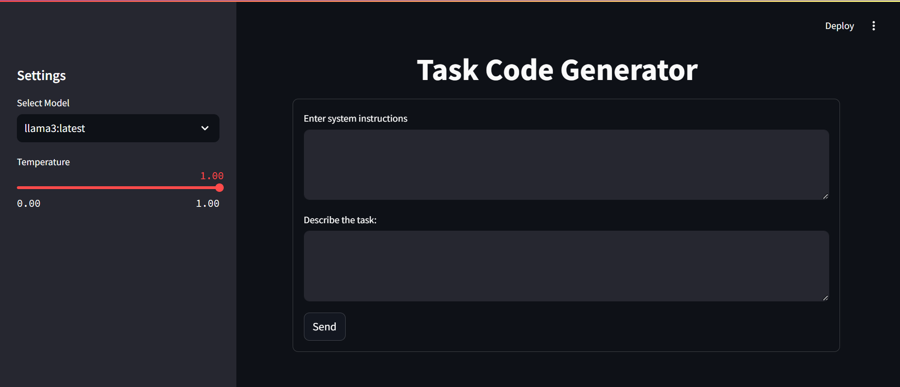

# Customizable and Secure Chatbot for Reliance Jio

## Project Overview
This project focuses on developing a customizable and secure chatbot to enhance user interaction at Reliance Jio. The chatbot allows users to select from multiple large language models (LLMs), adjust temperature settings, and personalize their interaction experience. The system ensures data security through localization, integrates with existing infrastructure, and provides a user interface similar to ChatGPT for seamless and efficient customer service.

## Features
- **Model Selection:** Choose from various LLMs (e.g., LLaMA3, phi3) to best suit user requirements.
- **Temperature Control:** Adjustable temperature settings allow for control over the creativity and predictability of the chatbot's responses.
- **Personalization:** Customize system instructions to adapt the chatbot's responses to different user roles and contexts, such as "lawyer" or "blockchain expert."
- **Context Recognition:** The chatbot recognizes and maintains context, reducing hallucinations and improving response accuracy.
- **Security and Privacy:** The chatbot operates locally on the user's system to ensure data privacy and security.

## **Documentation**

The project is documented in detail in the [Chatbot.docx](./Chatbot.docx) file. This document includes the project scope, design, implementation details, testing results, and user manual. It serves as a comprehensive guide for understanding the project's architecture, features, and functionalities.

## Technologies Used
- **Ollama LLaMA3:** A leading large language model for generating natural language responses.
- **LangChain:** A framework for building applications powered by LLMs.
- **Streamlit:** An open-source app framework used to create a user-friendly interface similar to ChatGPT.
- **Python:** The programming language used to develop the entire application.

## Installation and Setup

### Prerequisites
To set up and run this project, your system should meet the following requirements:

- **Operating System**: Windows 10 or later, macOS, or Linux.
- **Processor**: Intel i5 or equivalent.
- **Memory**: At least 8 GB RAM (16 GB recommended).
- **Storage**: 5 GB of available disk space for installation and models
- **Python**: Version 3.8 or later.
- **Pip**: Python package installer to manage project dependencies.

Ensure that Python and Pip are installed and properly configured in your system's environment variables.

### Step-by-Step Installation
1. **Clone the Repository:**
    ```bash
    git clone https://github.com/Lavilaan/Chatbot.git
    ```
2. **Install Dependencies:**
    ```bash
    pip install streamlit langchain streamlit-chat
    ```
3. **Run the Chatbot:**
    ```bash
    streamlit run chatbot.py
    ```

4. **Access the Interface:** Open your web browser and navigate to the local URL provided in the terminal to interact with the chatbot.

## Usage
1. **Select a Model:** Use the sidebar to choose your preferred LLM.
2. **Adjust Settings:** Set the temperature and system instructions to tailor the chatbot’s responses.
3. **Interact:** Enter your task description or prompt in the main input area and press "Send" to receive a response.

## Screenshots
Here's a preview of the chatbot interface:


*Replace the above path with the actual path to your screenshot file in the repository.*

## Project Structure
- `chatbot.py`: Main application script containing the chatbot code.
- `requirements.txt`: List of required Python libraries.
- `README.md`: This file, providing an overview of the project.
- `Chatbot.docx`: This is the documentation of the project.

## Contributing
Contributions to the project are welcome. Please fork the repository and submit a pull request with any enhancements or bug fixes.

## License
This project is licensed under the MIT License - see the [LICENSE](./LICENSE) file for details.
